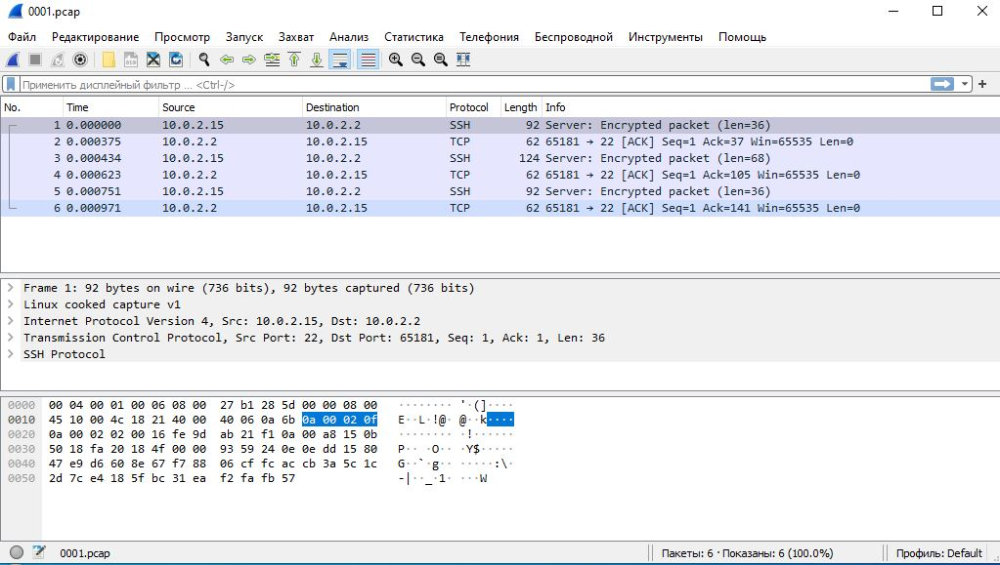

# Домашнее задание к занятию "3.9. Элементы безопасности информационных систем"
# 1. Установите Bitwarden плагин для браузера. Зарегестрируйтесь и сохраните несколько паролей.
сделано
# 2. Установите Google authenticator на мобильный телефон. Настройте вход в Bitwarden акаунт через Google authenticator OTP.
сделано
# 3. Установите apache2, сгенерируйте самоподписанный сертификат, настройте тестовый сайт для работы по HTTPS.
<pre>
sudo a2enmod ssl
Considering dependency setenvif for ssl:
Module setenvif already enabled
Considering dependency mime for ssl:
Module mime already enabled
Considering dependency socache_shmcb for ssl:
Enabling module socache_shmcb.
Enabling module ssl.
See /usr/share/doc/apache2/README.Debian.gz on how to configure SSL and create self-signed certificates.
To activate the new configuration, you need to run:
  systemctl restart apache2

sudo systemctl restart apache2
sudo openssl req -x509 -nodes -days 365 -newkey rsa:2048 -keyout /etc/ssl/private/apache-selfsigned.key -out /etc/ssl/certs/apache-selfsigned.crt

Generating a RSA private key
.....................................+++++
...............+++++
writing new private key to '/etc/ssl/private/apache-selfsigned.key'
-----
You are about to be asked to enter information that will be incorporated
into your certificate request.
What you are about to enter is what is called a Distinguished Name or a DN.
There are quite a few fields but you can leave some blank
For some fields there will be a default value,
If you enter '.', the field will be left blank.
-----
Country Name (2 letter code) [AU]:Ru
State or Province Name (full name) [Some-State]:Example
Locality Name (eg, city) []:Example
Organization Name (eg, company) [Internet Widgits Pty Ltd]:Example
Organizational Unit Name (eg, section) []:Example
Common Name (e.g. server FQDN or YOUR name) []:78.36.203.160
Email Address []:example@example.com

sudo nano /etc/apache2/sites-available/78.36.203.160.conf
</pre>
<pre>
<VirtualHost *:443>
   ServerName 78.36.203.160
   DocumentRoot /var/www/78.36.203.160

   SSLEngine on
   SSLCertificateFile /etc/ssl/certs/apache-selfsigned.crt
   SSLCertificateKeyFile /etc/ssl/private/apache-selfsigned.key
</VirtualHost>
</pre>
<pre>
sudo systemctl restart apache2
sudo mkdir /var/www/78.36.203.160
sudo nano /var/www/78.36.203.160/index.html
</pre>
 <pre>< h1>it worked!< /h1></pre>
<pre>
sudo a2ensite 78.36.203.160.conf
 
Enabling site 78.36.203.160.
To activate the new configuration, you need to run:
  systemctl reload apache2

sudo systemctl restart apache2
sudo apache2ctl configtest
AH00558: apache2: Could not reliably determine the server's fully qualified domain name, using 127.0.1.1. Set the 'ServerName' directive globally to suppress this message
Syntax OK
</pre>

<pre>
curl --insecure -v https://78.36.203.160
*   Trying 78.36.203.160:443...
* Connected to 78.36.203.160 (78.36.203.160) port 443 (#0)
* ALPN, offering h2
* ALPN, offering http/1.1
* successfully set certificate verify locations:
*  CAfile: /etc/ssl/certs/ca-certificates.crt
*  CApath: /etc/ssl/certs
* TLSv1.3 (OUT), TLS handshake, Client hello (1):
* TLSv1.3 (IN), TLS handshake, Server hello (2):
* TLSv1.3 (IN), TLS handshake, Encrypted Extensions (8):
* TLSv1.3 (IN), TLS handshake, Certificate (11):
* TLSv1.3 (IN), TLS handshake, CERT verify (15):
* TLSv1.3 (IN), TLS handshake, Finished (20):
* TLSv1.3 (OUT), TLS change cipher, Change cipher spec (1):
* TLSv1.3 (OUT), TLS handshake, Finished (20):
* SSL connection using TLSv1.3 / TLS_AES_256_GCM_SHA384
* ALPN, server accepted to use http/1.1
* Server certificate:
*  subject: C=RU; ST=Example; L=Example; O=Example; CN=78.36.203.160; emailAddress=example@example.com
*  start date: Jul 31 18:22:23 2022 GMT
*  expire date: Jul 31 18:22:23 2023 GMT
*  issuer: C=RU; ST=Example; L=Example; O=Example; CN=10.5.5.5; emailAddress=test@example.com
*  SSL certificate verify result: self signed certificate (18), continuing anyway.
> GET / HTTP/1.1
> Host: 78.36.203.160
> User-Agent: curl/7.74.0
> Accept: */*
>
* TLSv1.3 (IN), TLS handshake, Newsession Ticket (4):
* TLSv1.3 (IN), TLS handshake, Newsession Ticket (4):
* old SSL session ID is stale, removing
* Mark bundle as not supporting multiuse
< HTTP/1.1 200 OK
< Date: San, 31 Jun 2022 19:00:40 GMT
< Server: Apache/2.4.48 (Ubuntu)
< Last-Modified: Sat, 31 Jul 2022 18:22:23 GMT
< ETag: "14-5d6b9bbc20d84"
< Accept-Ranges: bytes
< Content-Length: 20
< Content-Type: text/html
<
<h1>it worked!</h1>
* Connection #0 to host 78.36.203.160 left intact
</pre>
# 4. Проверьте на TLS уязвимости произвольный сайт в интернете (кроме сайтов МВД, ФСБ, МинОбр, НацБанк, РосКосмос, РосАтом, РосНАНО и любых госкомпаний, объектов КИИ, ВПК ... и тому подобное).
<pre>
testssl.sh$ ./testssl.sh -U --sneaky https://www.ya.ru/

Testing vulnerabilities 

 Heartbleed (CVE-2014-0160)                not vulnerable (OK), no heartbeat extension
 CCS (CVE-2014-0224)                       not vulnerable (OK)
 Ticketbleed (CVE-2016-9244), experiment.  not vulnerable (OK)
 ROBOT                                     not vulnerable (OK)
 Secure Renegotiation (RFC 5746)           supported (OK)
 Secure Client-Initiated Renegotiation     not vulnerable (OK)
 CRIME, TLS (CVE-2012-4929)                not vulnerable (OK)
</pre>
# 5. Установите на Ubuntu ssh сервер, сгенерируйте новый приватный ключ. Скопируйте свой публичный ключ на другой сервер. Подключитесь к серверу по SSH-ключу.
<pre>
ssh-keygen
Generating public/private rsa key pair.
Enter file in which to save the key (/home/valerii/.ssh/id_rsa):
Enter passphrase (empty for no passphrase): 
Enter same passphrase again: 
Your identification has been saved in /home/valerii/.ssh/id_rsa
Your public key has been saved in /home/valerii/.ssh/id_rsa.pub
The key fingerprint is:
SHA256:PpDIRWUWSg8U84rzD2m5x0HuMbv8yV55+YqCW1jMGfo valerii@valerii
The key's randomart image is:
+---[RSA 3072]----+
|     .Bo=.       |
|     o O         |
|      o o .      |
|   . + o.+ o     |
|    = +oS =      |
|     o ==+   . . |
|      *o+*E o o  |
|     . =*+.o o . |
|      ..===.. ...|
+----[SHA256]-----+

ssh-copy-id valerii@127.0.0.1
/usr/bin/ssh-copy-id: INFO: attempting to log in with the new key(s), to filter out any that are already installed
/usr/bin/ssh-copy-id: INFO: 1 key(s) remain to be installed -- if you are prompted now it is to install the new keys
valerii@127.0.0.1's password: 

Number of key(s) added: 1

Now try logging into the machine, with:   "ssh 'valerii@127.0.0.1'"
and check to make sure that only the key(s) you wanted were added.

ssh valerii@127.0.0.1
Welcome to Ubuntu 20.04.3 LTS (GNU/Linux 5.4.0-122-generic aarch64)

 * Documentation:  https://help.ubuntu.com
 * Management:     https://landscape.canonical.com
 * Support:        https://ubuntu.com/advantage

  System information as of Вт 02 авг 2022 18:36:11 CEST

  System load:             1.95
  Usage of /:              54.4% of 18.04GB
  Memory usage:            50%
  Swap usage:              0%
  Processes:               245
  Users logged in:         1
  IPv4 address for enp0s9: 10.0.2.15
  IPv6 address for enp0s9: fec0::f0b4:d7ff:fec4:5888

 * Super-optimized for small spaces - read how we shrank the memory
   footprint of MicroK8s to make it the smallest full K8s around.

   https://ubuntu.com/blog/microk8s-memory-optimisation

108 updates can be applied immediately.
To see these additional updates run: apt list --upgradable

Last login: Tue Aug  2 18:27:34 2022 from 127.0.0.1
</pre>
# 6. Переименуйте файлы ключей из задания 5. Настройте файл конфигурации SSH клиента, так чтобы вход на удаленный сервер осуществлялся по имени сервера.
<pre>
mv /home/valerii/.ssh/id_rsa /home/valerii/.ssh/new_rsa

touch ~/.ssh/config && chmod 600 ~/.ssh/config

nano .ssh/config

    Host new
     HostName 127.0.0.1
     User valerii
     IdentityFile ~/.ssh/new_rsa

ssh new
Welcome to Ubuntu 20.04.3 LTS (GNU/Linux 5.4.0-122-generic aarch64)

 * Documentation:  https://help.ubuntu.com
 * Management:     https://landscape.canonical.com
 * Support:        https://ubuntu.com/advantage

  System information as of Вт 02 авг 2022 21:25:28 CEST

  System load:             0.1
  Usage of /:              54.4% of 18.04GB
  Memory usage:            56%
  Swap usage:              0%
  Processes:               228
  Users logged in:         1
  IPv4 address for enp0s9: 10.0.2.15
  IPv6 address for enp0s9: fec0::f0b4:d7ff:fec4:5888

 * Super-optimized for small spaces - read how we shrank the memory
   footprint of MicroK8s to make it the smallest full K8s around.

   https://ubuntu.com/blog/microk8s-memory-optimisation

108 updates can be applied immediately.
To see these additional updates run: apt list --upgradable

Last login: Tue Aug  2 21:11:23 2022 from 10.0.2.15

</pre>
# 7. Соберите дамп трафика утилитой tcpdump в формате pcap, 100 пакетов. Откройте файл pcap в Wireshark.
<pre>
sudo tcpdump -c 100 -w 0001.pcap -i enp0s9
tcpdump: listening on enp0s9, link-type EN10MB (Ethernet), capture size 262144 bytes
100 packets captured
100 packets received by filter
0 packets dropped by kernel
</pre>
